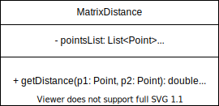

# Seminar 1 OOP

## Contact information

lorenzo.stecanella@upf.edu

## Geometric Point class

#### UML diagram


#### Implementation

````java
public class Point{
    // Attributes
    private double x;
    private double y;
    
    // Constructor method
    public Point(double initX, double initY){
        x = initX;
        y = initY;
    }
    
    // Getters and setters
    public double getX(){
        return x;
	}
    public double getY(){
        return y;
	}
    public void setX(double newX){
       x = newX;
	}
    public void setY(double newY){
        y = newY;
	}
    
    // Other methods
    public double distanceTo(Point point2){
        xDist = point2.x - x;
        yDist = point2.y - y;
        return Math.sqrt(xDist*xDist + yDist*yDist);
    }
    
    public void printPoint(){
         System.out.println("(" + x + ", " + y + ")");
    }
}
````

## Matrix Distance class

#### UML diagram



#### Implementation

```java
public class MatrixDistance{
    // Attributes
    private List<Point> pointsList;
    // private double[10][10] matrix;
    private List<List<Double>> matrix;
    
    // Constructor method
    public MatrixDistance(){
        pointsList = new ArrayList<Point>();
        matrix = new ArrayList<ArrayList<Double>>(); 
    }
     
    // Other methods
    //Note that 'getDistance' can be called from the "Point" class.	
    
    private void buildMatrix(Point newPoint){
        // TO DO
    }
    
    public void addPoint(Point newPoint){
        // TO DO
    }
}
```


